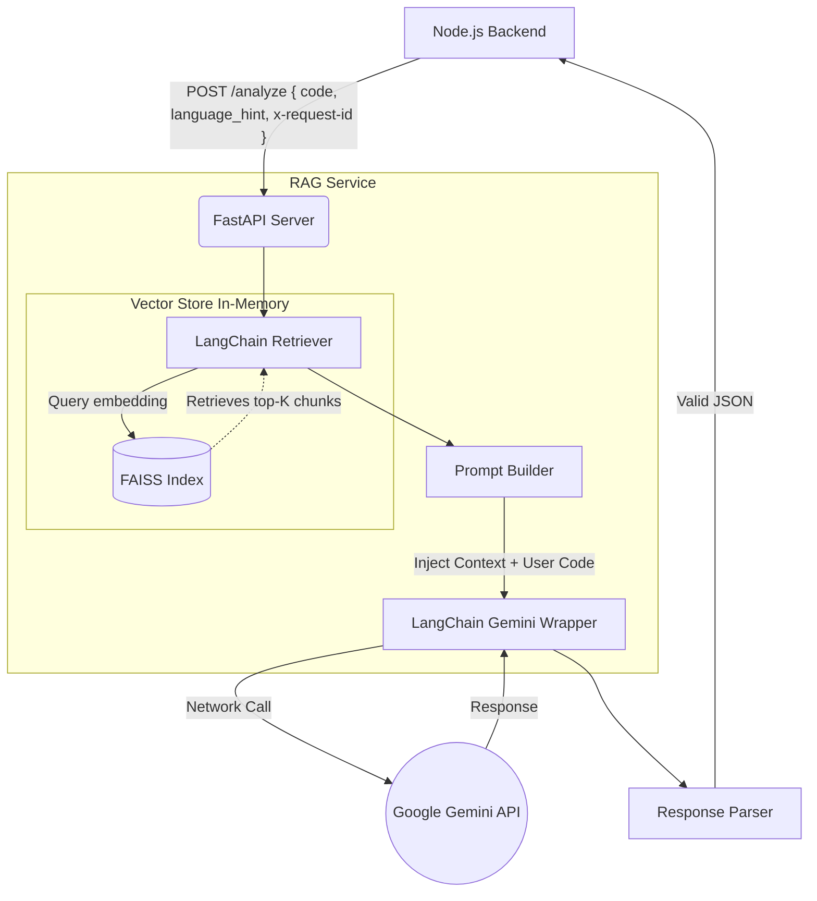

# LogicLLM RAG Architecture & Implementation Guide

This document serves as a comprehensive guide to the Retrieval-Augmented Generation (RAG) microservice powering LogicLLM. It details the technology stack, architectural decisions, and the specific implementations of LangChain and FAISS that make the AI code analysis highly context-aware.

---

## 1. Executive Summary

LogicLLM uses a dedicated Python microservice to provide **Retrieval-Augmented Generation**. Instead of relying solely on an LLM's base knowledge, the RAG service intercepts the user's code, searches a local database of curated coding standards, best practices, and security patterns, and injects this context into the LLM prompt. 

This ensures that the AI review is grounded in your project's specific coding guidelines (like clean code principles, SOLID patterns, and specific security vulnerability checks).

---

## 2. Technology Stack

- **Framework:** FastAPI (Python 3.10+)
- **LLM API:** Google Gemini API (`gemini-3.1-flash-lite`)
- **Orchestration:** LangChain (`langchain-google-genai`, `langchain-huggingface`)
- **Vector Database:** FAISS (Facebook AI Similarity Search)
- **Embeddings Model:** HuggingFace `all-MiniLM-L6-v2` (SentenceTransformers)
- **Server / Runtime:** Uvicorn

---

## 3. High-Level RAG Architecture



---

## 4. Deep Dive: FAISS Vector Store

**FAISS** (Facebook AI Similarity Search) is an open-source library used for efficient similarity search and clustering of dense vectors. In LogicLLM, it acts as our knowledge database.

### 4.1 How FAISS is implemented
When the Python microservice starts up, the `vector_store.py` module initializes the FAISS index **entirely in-memory**. 

1. **Document Loading:** It reads all `.md` files located in `rag_service/data/knowledge_base`.
2. **Text Splitting:** It uses LangChain's `RecursiveCharacterTextSplitter` to break the markdown files into smaller, digestible chunks (chunk size of 500 characters, with 100 characters of overlap to maintain context between chunks).
3. **Embedding:** It passes these chunks through the HuggingFace `all-MiniLM-L6-v2` embedding model. This model converts the text into high-dimensional vectors.
4. **Indexing:** These vectors are loaded into FAISS. 

### 4.2 Architectural Decision: In-Memory vs. Local Disk
Originally, the project saved the FAISS index to disk as an `index.faiss` and `index.pkl` file. We explicitly pivoted to an **in-memory** build on startup for two reasons:
- **Security:** Python `pickle` files (`.pkl`) are notoriously vulnerable to arbitrary code execution (ACE) if manipulated. LangChain actually requires setting `allow_dangerous_deserialization=True` to load local FAISS indexes. By building in-memory from flat markdown files, we completely bypass this security vulnerability.
- **Data Freshness:** The knowledge base is small enough that building it on startup takes only a few seconds. This guarantees the index is always perfectly synced with the latest markdown files without requiring a manual "re-ingestion" step.

---

## 5. Deep Dive: LangChain Integration

**LangChain** is the orchestration framework used to tie the embeddings, the vector store, and the LLM together.

### 5.1 HuggingFace Embeddings
We use `langchain-huggingface` to load the embedding model locally. This is highly cost-effective and extremely fast because the text is embedded using your local CPU/GPU rather than relying on a paid external embedding API. The code query is embedded using the exact same local model before hitting FAISS.

### 5.2 The LangChain Retriever
The FAISS index is wrapped in a LangChain Retriever interface:
```python
retriever = vectorstore.as_retriever(search_kwargs={"k": 3})
```
When a user submits code, LangChain automatically embeds the code, performs a cosine similarity search against FAISS, and returns the top 3 most semantically similar knowledge chunks.

### 5.3 Gemini Invocation
We use `ChatGoogleGenerativeAI` from the `langchain-google-genai` package. 
- It wraps the Google Gemini API, providing a standardized interface.
- It is configured with `gemini-3.1-flash-lite`, a blazing fast model that is perfect for low-latency code review operations.
- It includes a 120-second timeout configuration to prevent hanging connections.

---

## 6. The RAG Prompt Pipeline

The magic happens in `rag_pipeline.py`. 

1. **Context Aggregation:** The retrieved chunks from FAISS are concatenated into a single context string.
2. **Prompt Construction:** A strict, system-level prompt is built instructing Gemini to act as a Senior Software Engineer.
3. **Injection:** 
   - The FAISS Context is injected.
   - The user's `language_hint` (e.g., "Python") is injected to guide the model.
   - The user's raw code is injected.
4. **JSON Enforcement:** The prompt demands the output be strictly formatted as a JSON string containing specific keys (`language`, `bugs`, `improvements`, `explanation`, `optimized_code`).

---

## 7. Parsing and Fallbacks

LLMs can occasionally output malformed JSON or wrap their JSON in Markdown formatting (e.g., ```json ... ```). 

To ensure the Node.js backend never crashes due to a parsing error, the RAG service utilizes a highly robust `_parse_json_safe` utility:
- It strips out markdown fences.
- It uses regex to isolate the JSON block if the model included conversational text before or after the JSON.
- If the model completely fails, a static fallback dictionary is safely returned, ensuring the frontend gracefully displays an error rather than crashing.

---

## 8. Robust Logging & Tracing

To monitor this complex flow, the service utilizes **Distributed Tracing**.
- The Node.js backend generates an `x-request-id` UUID.
- FastAPI extracts this header.
- The Python logger injects `[ReqID: <uuid>]` into every single log line associated with that request. 
- This allows developers to track a request exactly from the React frontend, through the Node router, into the Python FAISS retriever, out to Google Gemini, and back to the client.
