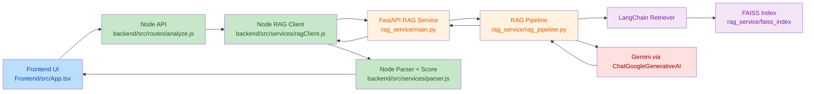
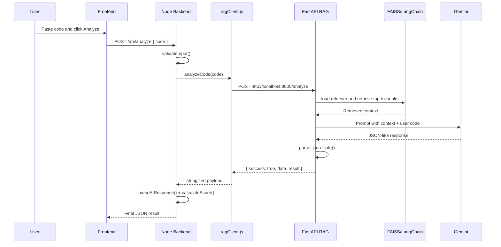

# LogicLLM RAG Audit

Full audit of the Retrieval-Augmented Generation stack in this repository, including the FastAPI RAG service, FAISS vector store, LangChain usage, Node.js bridge, frontend integration, operational assumptions, broken behaviors, documentation drift, and observed faults.

Audit date: 2026-07-14
Repository: `c:\Users\Abhinav\Desktop\Projects\LogicLLM`

---

## 1. Scope

This audit covers:

- `rag_service/main.py`
- `rag_service/rag_pipeline.py`
- `rag_service/vector_store.py`
- `rag_service/ingest.py`
- `rag_service/config.py`
- `rag_service/requirements.txt`
- `rag_service/data/knowledge_base/*.md`
- `backend/src/services/ragClient.js`
- `backend/src/routes/analyze.js`
- `backend/src/services/parser.js`
- `backend/src/services/fallback.js`
- `backend/src/middleware/validator.js`
- `backend/src/index.js`
- `runner.js`
- `README.md`
- `backend_implementation.md`
- `Frontend/src/App.tsx`

This audit is based on the live code on disk, not just the repo documentation.

---

## 2. Executive Summary

The RAG system is real, wired end to end, and structurally understandable:

- Frontend sends code to Node
- Node validates and forwards to Python
- Python retrieves context from a local FAISS index through LangChain
- Gemini is called with retrieved context plus user code
- Python returns structured analysis
- Node parses, scores, and returns the final payload to the frontend

At a high level, the implementation is workable, but it has several important weaknesses:

1. Documentation drift is significant. `README.md` and `backend_implementation.md` no longer fully match the live code.
2. The FAISS load path still uses `allow_dangerous_deserialization=True`.
3. LangChain components are already throwing deprecation warnings at runtime.
4. Retrieval quality is basic: fixed `k=2`, no metadata, no citations, no reranking, no source tracking.
5. `language_hint` exists in the Python API model but is not actually used anywhere in the retrieval or prompting pipeline.
6. The RAG service has basic logging now, but still lacks robust request tracing, metrics, schema validation, and defensive controls.
7. The orchestration path in `runner.js` is Windows-specific and tightly coupled to local folders.
8. Prompt and parsing logic are still regex-driven and fragile under malformed model output.
9. There are no tests around the RAG path.

Bottom line:

- The system works as a local dev-oriented RAG code reviewer.
- It is not yet production-hardened.
- FAISS and LangChain are integrated correctly enough to function, but the implementation is shallow and operationally brittle.

---

## 3. Real Architecture

### 3.1 End-to-end architecture

### 3.2 Request flow

---

## 4. What Is Actually Implemented

## 4.1 FastAPI entrypoint

File: `rag_service/main.py`

Live behavior:

- Creates a FastAPI app titled `LogicLLM RAG Service`
- Defines request schema:
  - `code: str`
  - `language_hint: Optional[str] = None`
- On startup, runs `analyze_code("print('warmup')")`
- Exposes:
  - `POST /analyze`
  - `GET /health`
- Wraps request failures in `HTTPException(status_code=500, detail=...)`
- Logs startup, request details, success counts, and tracebacks

Important note:

- `language_hint` is accepted by the API model but ignored by the rest of the stack.

## 4.2 RAG pipeline

File: `rag_service/rag_pipeline.py`

Live behavior:

- Loads `.env` from `rag_service/.env`
- Maps `GEMMA_API_KEY` into `GOOGLE_API_KEY`
- Uses `GEMINI_MODEL` with default `gemini-2.0-flash`
- Lazily initializes:
  - `_retriever`
  - `_llm`
- Retrieves relevant chunks with:
  - `load_index().as_retriever(search_kwargs={"k": 2})`
- Builds a single prompt template with:
  - reference context
  - raw user code
  - JSON-only response instruction
- Calls Gemini through `ChatGoogleGenerativeAI`
- Retries once if JSON parsing fails
- Returns a fallback object if both attempts fail

This is the core RAG path.

## 4.3 FAISS layer

File: `rag_service/vector_store.py`

Live behavior:

- Reads markdown files from `rag_service/data/knowledge_base`
- Splits them using `RecursiveCharacterTextSplitter`
  - `chunk_size=500`
  - `chunk_overlap=100`
- Embeds them with:
  - `sentence-transformers/all-MiniLM-L6-v2`
- Stores vectors using LangChain FAISS integration
- Saves index to:
  - `rag_service/faiss_index/index.faiss`
  - `rag_service/faiss_index/index.pkl`
- If index files are missing or corrupt, auto-rebuilds from source markdown

This is an improvement over older docs, which still describe a more brittle behavior.

## 4.4 Node integration

Files:

- `backend/src/services/ragClient.js`
- `backend/src/routes/analyze.js`
- `backend/src/services/parser.js`
- `backend/src/services/fallback.js`
- `backend/src/middleware/validator.js`

Live behavior:

- Node validates `code`
- Node calls Python RAG via axios
- Python result is stringified inside `ragClient.js`
- Node reparses that payload in `parser.js`
- Node computes score locally
- Node returns result to frontend

The system is intentionally layered, but the data crosses JSON boundaries more times than needed.

---

## 5. Knowledge Base Audit

Directory:

- `rag_service/data/knowledge_base`

Files present:

1. `clean_code_principles.md`
2. `common_security_bugs.md`
3. `java_best_practices.md`
4. `javascript_best_practices.md`
5. `performance_patterns.md`
6. `python_best_practices.md`
7. `typescript_best_practices.md`

Observed characteristics:

- Small curated corpus
- All markdown
- Mostly best-practice and bug-pattern guidance
- No per-chunk provenance metadata retained
- No source URLs
- No timestamps or versioning inside the documents
- No language-specific weighting
- No query rewriting before retrieval

What this means:

- The system is not retrieving from a broad corpus.
- It is retrieving from a small static handbook.
- This makes it cheap and simple, but also shallow.

---

## 6. How RAG, FAISS, and LangChain Work Here

## 6.1 RAG flow in this project

In this repository, RAG means:

1. Take the user's raw code as a search query
2. Embed that query using the same embedding model used for the knowledge base
3. Search FAISS for the nearest chunks
4. Concatenate those chunks into prompt context
5. Ask Gemini to produce a code review using that context

This is classic retrieval-augmented prompting, but in a minimal form.

## 6.2 FAISS role

FAISS is used only as a local nearest-neighbor store:

- no hybrid search
- no metadata filtering
- no re-ranking
- no document IDs surfaced to the user
- no scores returned to the frontend

It is effectively a local semantic lookup table.

## 6.3 LangChain role

LangChain is used for three things:

1. `HuggingFaceEmbeddings`
2. `FAISS` vectorstore wrapper
3. `ChatGoogleGenerativeAI`

It is not using:

- agents
- tools
- chains beyond very light wrappers
- output parsers
- structured schemas
- LangSmith tracing
- prompt templates from LangChain core
- retriever composition

So this is a LangChain-assisted integration, not a deep LangChain architecture.

---

## 7. Detailed File Findings

## 7.1 `rag_service/main.py`

Good:

- Now has real logging
- Wraps failed analysis in HTTP 500
- Startup warmup is explicitly logged
- Health endpoint exists

Problems:

1. `language_hint` is accepted but not used downstream.
2. `@app.on_event("startup")` is older style FastAPI lifecycle handling.
3. Warmup runs a full `analyze_code()` path, which can do retrieval and LLM boot work, but also means startup can trigger expensive model activity immediately.
4. Health endpoint is only a liveness check. It does not verify retriever health, FAISS load success, embedding availability, or Gemini configuration.

## 7.2 `rag_service/rag_pipeline.py`

Good:

- Lazy singleton initialization avoids immediate import-time crashes
- Retry-on-parse-failure is better than a single attempt
- Prompt is clear and explicit

Problems:

1. `language_hint` is not part of the prompt or retriever query.
2. The retriever uses a fixed `k=2`, which is very limited.
3. Prompt assembly is raw string formatting with no token budgeting.
4. No truncation strategy exists for very large input code.
5. No model timeout is set on `ChatGoogleGenerativeAI`.
6. No temperature or determinism settings are defined.
7. `_parse_json_safe()` uses regex extraction `\{[\s\S]*\}`, which is greedy and fragile.
8. The fallback returns plain text from `raw_content[:500]` into `explanation`, which can surface malformed or irrelevant model output to the frontend.
9. No schema validator exists for the model output beyond shallow field normalization.
10. The prompt requests only `language`, `bugs`, `improvements`, `explanation`, and `optimized_code`, while Node later computes score independently. That split is okay, but undocumented at the API boundary.

## 7.3 `rag_service/vector_store.py`

Good:

- Auto-rebuild path now exists
- Missing/corrupt FAISS index no longer necessarily bricks startup forever
- Chunking is simple and understandable

Problems:

1. `HuggingFaceEmbeddings` is deprecated in the installed LangChain stack.
2. Runtime emits deprecation warnings during actual load.
3. `allow_dangerous_deserialization=True` remains a security footgun.
4. Chunk metadata is lost because `create_documents(docs)` is called without metadata per source file.
5. No deterministic ordering guarantee is enforced on `DATA_PATH.iterdir()`.
6. No duplicate-document filtering exists.
7. No content hashing or incremental indexing exists.
8. No scoring diagnostics are exposed.
9. No embedding cache strategy is defined.

## 7.4 `rag_service/ingest.py`

Good:

- Minimal and easy to run

Problems:

1. No CLI arguments
2. No rebuild confirmation
3. No logging in the script itself
4. No validation report after index creation

## 7.5 `rag_service/config.py`

Current contents:

- loads dotenv
- exports `GEMMA_API_KEY`
- exports `MODEL = "gemini-2.0-flash"`

Problem:

- This file is effectively dead code.
- `rag_pipeline.py` does not import it.
- It can mislead maintainers into thinking configuration is centralized when it is not.

## 7.6 `backend/src/services/ragClient.js`

Good:

- Simple and readable
- Measures elapsed time
- Returns stable success/failure shape

Problems:

1. Hardcoded `http://localhost:8000`
2. No environment override for RAG service URL
3. No retry strategy
4. No request ID propagation to Python
5. Python result object is stringified and then reparsed later, which is unnecessary coupling
6. Uses `console.error` instead of the project logger

## 7.7 `backend/src/routes/analyze.js`

Good:

- Request ID added
- Clear flow: validate -> analyze -> parse -> fallback
- Local response timing added

Problems:

1. Fallbacks still return HTTP 200, so transport success can hide functional failure.
2. Request ID is not forwarded to Python, so logs cannot be correlated across services.
3. The route trusts the Python service result shape and relies on later parsing fallback.

## 7.8 `backend/src/services/parser.js`

Good:

- Provides normalization
- Computes score consistently in Node

Problems:

1. Greedy regex JSON extraction is fragile.
2. If the model includes extra braces in explanation/code, parsing can break.
3. Score is simplistic:
   - `-5` per bug
   - `-2` per improvement
4. Severity is ignored entirely.
5. `time` may temporarily come from parsed payload but is then overwritten in route logic.

## 7.9 `backend/src/index.js`

Good:

- Relaxed localhost-friendly CORS for dev
- JSON body limit applied
- Health endpoint exists

Problems:

1. `express.json({ limit: '100kb' })` is close to the validator's 50,000-char input limit, but the two constraints are not explicitly aligned.
2. Error middleware returns generic fallback but does not include request ID.

## 7.10 `runner.js`

Good:

- Automates local startup
- Waits for Python RAG health before bringing up other services
- Frees ports automatically

Problems:

1. Windows-specific orchestration
2. Hardcoded `.venv_local\\Scripts\\python.exe`
3. Uses `shell: true`
4. No configurable ports via env
5. Health check only checks `/health`, not deeper readiness
6. Force-kills processes after 1 second

---

## 8. Runtime Observations

I performed a local runtime-safe FAISS smoke probe using the project venv to load the vector store without hitting Gemini directly.

Observed runtime warnings:

1. Pydantic warning from dependencies:
   - `Field "model_name" in HuggingFaceInferenceAPIEmbeddings has conflict with protected namespace "model_".`
2. LangChain deprecation warning:
   - `HuggingFaceEmbeddings` was deprecated in LangChain 0.2.2 and will be removed in 1.0
3. TensorFlow informational output appeared during embedding/model stack initialization.

What this confirms:

- The FAISS/embedding path is real and reachable locally.
- The current dependency combination is already noisy at runtime.
- The embedding load path is heavy enough that it is not an instant operation.

What I did not verify in runtime:

- A full Gemini round-trip, because that would depend on live external API behavior and credentials.

---

## 9. Broken or Misleading Things

These are not just style issues. These are real faults, drift points, or broken assumptions.

## 9.1 Documentation drift

### `README.md`

Problems:

1. Mentions files that do not exist:
   - `rag_service/prompts.py`
   - `rag_service/schemas.py`
2. Describes RAG health response differently from live code.
3. Default model text still references `gemini-flash-latest` in places, while live fallback default in code is `gemini-2.0-flash`.
4. Project structure says `frontend/`, but the live folder is `Frontend/`.

### `backend_implementation.md`

Problems:

1. Claims `language_hint` is part of the data flow to Python, but Node does not send it.
2. States behaviors that were older snapshots of the implementation.
3. Describes function responsibilities that are no longer exactly true.

Net effect:

- Repo docs are no longer a trustworthy source of truth for the RAG stack.

## 9.2 Dead config path

`rag_service/config.py` exists but is not actually used by `rag_pipeline.py`.

This is broken from a maintainability perspective because it looks canonical but is not authoritative.

## 9.3 Unused API field

`language_hint` exists in the FastAPI request model but:

- frontend does not send it
- backend does not forward it
- RAG pipeline does not consume it

So the field is currently dead.

## 9.4 Double serialization

Python returns JSON object -> Node stringifies it -> parser reparses it.

This is not technically broken, but it is needless complexity and an avoidable failure surface.

## 9.5 Weak readiness

`/health` returning `{ "status": "ok" }` or `{ "status": "ok", "service": ... }` does not prove:

- FAISS index can load
- embeddings can initialize
- Gemini key is present
- prompt path is functioning

So operationally the service can look healthy while still being partially broken.

---

## 10. Faults and Risks by Severity

## 10.1 High severity

### H1. Dangerous FAISS deserialization

Location:

- `rag_service/vector_store.py`

Issue:

- `FAISS.load_local(..., allow_dangerous_deserialization=True)`

Risk:

- If an attacker can replace `index.pkl`, arbitrary code execution risk exists during load.

### H2. Dependency deprecation already active at runtime

Location:

- `rag_service/vector_store.py`
- installed LangChain stack

Issue:

- `HuggingFaceEmbeddings` is deprecated and warning during actual execution.

Risk:

- Future LangChain upgrade will break this path.

### H3. No end-to-end request correlation

Locations:

- `backend/src/routes/analyze.js`
- `backend/src/services/ragClient.js`
- `rag_service/main.py`

Issue:

- Node request ID is not forwarded to Python.

Risk:

- Multi-service debugging is weak and incident analysis is slower.

### H4. Output parsing is regex-fragile in both Python and Node

Locations:

- `rag_service/rag_pipeline.py`
- `backend/src/services/parser.js`

Issue:

- Both layers rely on broad regex JSON extraction.

Risk:

- Unexpected model formatting can create silent degradation or fallback.

## 10.2 Medium severity

### M1. Retrieval is too shallow

Issue:

- fixed `k=2`
- no reranking
- no metadata
- no source attribution

Risk:

- Quality ceiling stays low even if the model is strong.

### M2. No token budget management

Issue:

- Long code is inserted directly into the prompt.

Risk:

- Large inputs can reduce context quality or push model limits.

### M3. `language_hint` is dead

Issue:

- API suggests one behavior, implementation does another.

Risk:

- Future contributors assume language-aware retrieval exists when it does not.

### M4. Health endpoint is not a readiness check

Risk:

- Devops false positives.

### M5. Runtime stack is noisy and heavy

Risk:

- Slower cold starts and harder debugging.

## 10.3 Low severity

### L1. `config.py` dead code
### L2. `ingest.py` too minimal
### L3. Docs out of date
### L4. Hardcoded localhost URL
### L5. Windows-specific runner
### L6. Score logic is oversimplified
### L7. No citations returned to UI

---

## 11. FAISS-Specific Audit

## 11.1 What FAISS is doing correctly

- Persisting an index locally
- Serving semantic nearest-neighbor retrieval
- Small corpus means local FAISS is sufficient
- Auto-rebuild path improves resilience

## 11.2 What FAISS is not doing here

- no filtered search
- no document-level provenance
- no rank diagnostics surfaced
- no similarity score exposure
- no compression/index tuning
- no online updates
- no sharding
- no concurrency controls

## 11.3 FAISS design limitations in this codebase

1. Chunk creation loses source metadata.
2. All markdown files are treated equally.
3. Search results are not inspectable in the UI.
4. There is no mechanism to explain why a chunk matched.
5. The index format relies on pickle sidecar state, which creates the deserialization concern.

---

## 12. LangChain-Specific Audit

## 12.1 Where LangChain is used

- `langchain_google_genai.ChatGoogleGenerativeAI`
- `langchain_community.vectorstores.FAISS`
- `langchain_community.embeddings.HuggingFaceEmbeddings`
- `langchain_text_splitters.RecursiveCharacterTextSplitter`

## 12.2 LangChain issues

1. Deprecated embeddings class still in use.
2. Community imports are used, but migration path is not documented.
3. No structured output parser is used.
4. No retriever abstraction beyond `as_retriever(search_kwargs={"k": 2})`.
5. No callback manager, tracing, or observability tooling is configured.
6. No prompt object or reusable template abstraction from LangChain is used.

## 12.3 Practical effect

LangChain is providing convenience wrappers, but the stack is not taking advantage of stronger LangChain features that would improve:

- output validation
- tracing
- retriever diagnostics
- prompt lifecycle
- maintainability

---

## 13. Prompt Engineering Audit

Prompt source:

- inline string in `rag_service/rag_pipeline.py`

Strengths:

- clear role
- clear required sections
- explicit JSON-only instruction
- retry path strengthens the JSON instruction

Weaknesses:

1. No language hint injection
2. No source citation request
3. No bug severity output
4. No confidence scoring
5. No instruction for concise bug titles versus verbose descriptions
6. No token-aware truncation or context ordering policy
7. No schema version

Potential failure modes:

- model adds prose before JSON
- model emits nested braces in explanation/code
- model includes markdown fences despite instruction
- model returns malformed arrays or nulls

Current mitigation:

- regex extraction
- one retry
- fallback object

That is better than nothing, but still brittle.

---

## 14. Frontend and Backend Contract Audit

Frontend file:

- `Frontend/src/App.tsx`

Current contract:

- frontend sends only `{ code }`
- frontend expects:
  - `language`
  - `bugs`
  - `improvements`
  - `explanation`
  - `optimized_code`
  - `score`
  - `time`
  - optional `fallback`

Contract issues:

1. No retrieval metadata is surfaced.
2. No source chunks are shown.
3. No degraded-state explanation beyond generic error/fallback messaging.
4. No distinction between:
   - RAG failure
   - parse failure
   - model failure
   - weak retrieval

The UI presents the analysis as authoritative even when it may have degraded internally.

---

## 15. Security Audit

Good:

- secrets are loaded from `.env`
- Node validates code presence/type/size
- CORS is restricted to localhost-style origins in dev

Risks:

1. `allow_dangerous_deserialization=True`
2. no auth on internal service call
3. no rate limiting
4. no request signing between Node and Python
5. user code is sent verbatim to external LLM provider
6. no redaction path for secrets inside uploaded code

This is acceptable for a local dev tool, but not safe enough for broader exposure.

---

## 16. Performance and Scalability Audit

Current behavior:

- embeddings are initialized lazily
- retriever and LLM are cached as module-level singletons
- FAISS is local
- corpus is small

This is fine for a single local developer workflow.

Limits:

1. Cold start on embedding stack is non-trivial.
2. No batching.
3. No async request handling for model work.
4. No queue or concurrency control.
5. No caching of repeated analysis requests.
6. No prompt-size controls.
7. No multi-user scaling design.

---

## 17. Testability and Missing Tests

There are no visible automated tests around:

- FAISS index creation
- FAISS index loading
- retriever output quality
- prompt construction
- `_parse_json_safe`
- Python `/analyze` endpoint
- Node `ragClient.js`
- end-to-end RAG flow

This is a major quality gap.

Minimum missing tests:

1. Unit test for `_parse_json_safe`
2. Unit test for `parseAIResponse`
3. Smoke test for `load_index()`
4. Smoke test for `build_index()`
5. Integration test for FastAPI `/analyze` with mocked Gemini
6. Integration test for Node `/api/analyze` with mocked Python service

---

## 18. What Is Working Well

Despite the issues, several parts are solid:

1. The architecture is easy to reason about.
2. The RAG path is modular.
3. Lazy initialization in Python is better than eager import-time loading.
4. Auto-rebuild of missing/corrupt FAISS index is useful.
5. Node-side validation and fallback logic are sensible.
6. The frontend contract is simple.
7. The local runner gives a decent dev experience.

---

## 19. Recommended Fixes in Priority Order

## P0 - Fix first

1. Replace deprecated `HuggingFaceEmbeddings` with the supported package/path.
2. Remove or mitigate `allow_dangerous_deserialization=True`.
3. Forward `requestId` from Node to Python logs.
4. Remove dead `language_hint` or implement it fully.
5. Remove dead `config.py` or make it the real source of truth.
6. Stop double-serializing the Python result in `ragClient.js`.
7. Add a real readiness check that validates FAISS load and model config.

## P1 - Quality improvements

1. Add source metadata when building documents.
2. Return retrieved source info to Node/frontend.
3. Make retriever `k` configurable.
4. Add token budgeting and input truncation strategy.
5. Replace regex JSON extraction with stricter structured parsing.

## P2 - Hardening

1. Add tests
2. Add rate limiting
3. Add timeout settings for Gemini client
4. Add structured logging
5. Make RAG service URL configurable
6. Reduce Windows-only assumptions in `runner.js`

---

## 20. Final Verdict

The current system is a valid lightweight RAG implementation using:

- FastAPI
- LangChain
- FAISS
- HuggingFace embeddings
- Gemini

It is not fake RAG, and it is not just prompt stuffing. Retrieval, vector storage, and context injection are genuinely implemented.

But it is still an early-stage implementation with these core weaknesses:

- shallow retrieval design
- outdated/stale docs
- dependency drift
- fragile parsing
- dead/unused fields
- limited observability
- no test coverage
- security concerns around FAISS deserialization

If judged as a local prototype: good foundation.

If judged as a production-grade RAG service: not ready yet.

---

## 21. Quick Truth Table

| Area | Status | Notes |
| --- | --- | --- |
| Frontend -> Node wiring | Working | Simple and correct |
| Node -> Python RAG wiring | Working | Hardcoded localhost |
| FastAPI service | Working | Basic lifecycle and logging |
| LangChain retriever usage | Working | Minimal, shallow |
| FAISS persistence | Working | Local files present |
| Auto-rebuild of index | Working | Implemented in live code |
| Metadata/citations | Missing | No source tracking |
| JSON robustness | Weak | Regex-based |
| Dependency health | Weak | Deprecation warnings already visible |
| Security posture | Weak | Dangerous deserialization flag remains |
| Docs accuracy | Broken | Significant drift |
| Test coverage | Missing | No visible automated tests |

---

## 22. Runtime Evidence Summary

Observed on this machine:

- `rag_service/faiss_index/index.faiss` exists
- `rag_service/faiss_index/index.pkl` exists
- `rag_service/.venv_local/Scripts/python.exe` exists
- runtime load path emitted:
  - LangChain deprecation warning
  - Pydantic namespace warning
  - TensorFlow initialization output

That confirms the stack is installed and active locally, but also confirms maintenance debt in the dependency layer.
